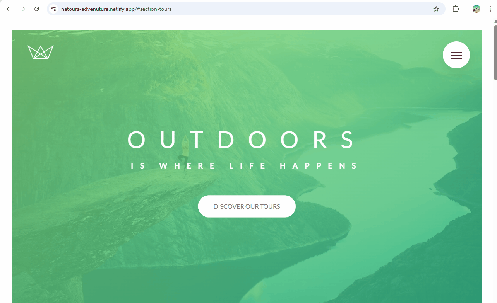

# Natours Project



> This GIF demonstrates the main features of the Omnifood website.

<br>
**Natours** is a modern, adventure-themed website for nature lovers and travelers 🏕️. Fully responsive design built with **HTML, CSS, and SASS** ✨. Explore breathtaking tours and embrace the wild! 🌿🚀

## 📌 About the Project

Natours is a web application designed for adventurers and nature enthusiasts. It features a clean, modern, and fully responsive design, ensuring a seamless experience across all devices.

## 🛠️ Technologies Used

- **Frontend**: HTML, CSS, SASS
- **Code Editor**: Visual Studio Code
- **Deployment**: Netlify

## 🔧 Tools and Resources

Here are the tools and resources used during the development of this project:

### Fonts and Typography
- **🌐 Google Fonts**: For modern and readable typography.

### Colors and Design Tools
- **🎨 Tint and Shade Generator**: For creating consistent color palettes.
- **🌈 Coolors Contrast Checker**: To ensure accessibility and readability.
- **🎨 Open Color**: For a well-balanced color scheme.

### Images and Videos
- **📷 Unsplash**: For high-quality, royalty-free images.

## 🎨 Icons and Design Resources

- **🌐 Icomoon**: [Visit Icomoon](https://icomoon.io) for scalable and customizable icons.

## 🚀 Deployment

The project is deployed on **Netlify**. You can visit the live site here:  
🌐 [Natours Live Demo](https://natours-advenuture.netlify.app/)

## 📂 Repository

You can find the source code for this project on GitHub:  
🔗 [Natours GitHub Repository](https://github.com/yourusername/natours-project.git)

## 🖥️ How to Run Locally

1. **Clone the repository**:
   ```bash
   git clone https://github.com/Okyanusaydgn/Natours_Project.git
   ```
2. **Navigate to the project folder**:
   ```bash
   cd natours-project
   ```
3. **Open in Visual Studio Code**:
   ```bash
   code .
   ```
4. **Install dependencies (if you haven't already):
   ```bash
   npm install
   ```
5. **Start a local server** (Optional, if needed):
   ```bash
   npm start
   ```

Enjoy your adventure with Natours! 🌍✨
